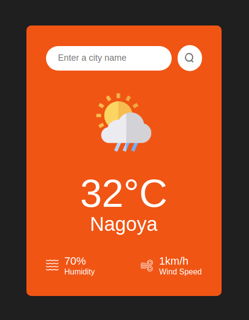

# Anemoi App

## Table Of Contents

- [About](#about)
- [Description](#description)
- [Features](#features)
- [Demo](#demo)
- [Stack](#stack)

## About

A spartan weather web application.

The name 'anemoi' derives from the collective name for the four Greek gods of the winds: Boreas, Notus, Eurus, & Zephyrus.

## Description

The objective is to learn ES6 & React features, especially:

- template literals
- arrow function
- OR operator
- ternary operator
- event handlers
- `<input>` component
- `async` function
- `fetch()` method
- `useState` Hook
- `useEffect` Hook
- `useRef` Hook

## Features

## Demo

https://anemoi.vercel.app/

## Stack

- HTML5
- CSS3
- ES6
- Vite
- React
- OpenWeatherMap API
